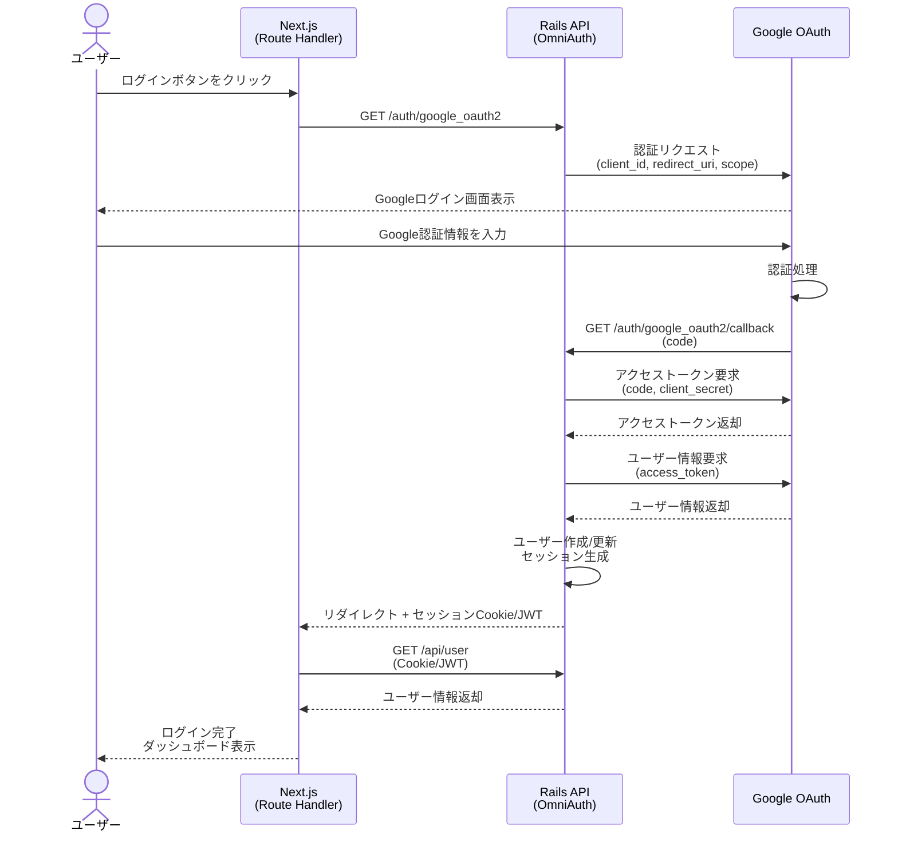

# 認証の流れ

# やるべきこと

Rails 側でやるべきなのは
omniauth からどんな情報が返ってくるか

sessions#create で以下
request.env['omniauth.auth']の中身を調べればいい
uid UserIdentifier は Idp (Identity Provider)内でユーザを一位に識別する識別し。
複数の idp に対応する場合は provider と uid の組み合わせで一位性を保証する必要がある。

uid: "uid"
info => {
"name" => "John Smith",
"email" => "john@example.com",
"image" => "https://lh4.googleusercontent.com/photo.jpg",
}
"credentials" => {
"token" => "TOKEN",
"refresh_token" => "REFRESH_TOKEN",
"expires_at" => 1496120719,
"expires" => true
},

これらを取得する必要がある。

- User テーブルの作成
- uid, name, email, image で良いか
- 全て null false で良い

model ファイルは作成、全て validates の present をつけた。

情報としてはめっちゃ良いけど next.js から rails の omniauth endpoint 叩くのだるそうだったから omniauth 断念

Next.js 側で nextauth.js やることにした。

結局またこれか
