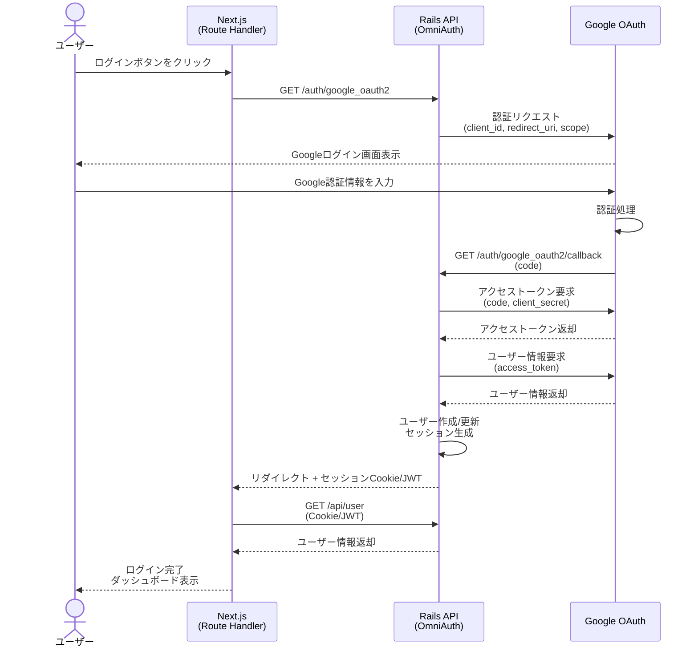

# 認証の流れ

```mermaid
sequenceDiagram
    actor User as ユーザー
    participant Next as Next.js<br/>(Route Handler)
    participant Rails as Rails API<br/>(OmniAuth)
    participant Google as Google OAuth

    User->>Next: ログインボタンをクリック
    Next->>Rails: GET /auth/google_oauth2
    Rails->>Google: 認証リクエスト<br/>(client_id, redirect_uri, scope)
    Google-->>User: Googleログイン画面表示
    User->>Google: Google認証情報を入力
    Google->>Google: 認証処理
    Google->>Rails: GET /auth/google_oauth2/callback<br/>(code)
    Rails->>Google: アクセストークン要求<br/>(code, client_secret)
    Google-->>Rails: アクセストークン返却
    Rails->>Google: ユーザー情報要求<br/>(access_token)
    Google-->>Rails: ユーザー情報返却
    Rails->>Rails: ユーザー作成/更新<br/>セッション生成
    Rails-->>Next: リダイレクト + セッションCookie/JWT
    Next->>Rails: GET /api/user<br/>(Cookie/JWT)
    Rails-->>Next: ユーザー情報返却
    Next-->>User: ログイン完了<br/>ダッシュボード表示

```
